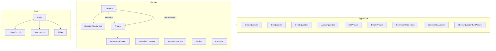
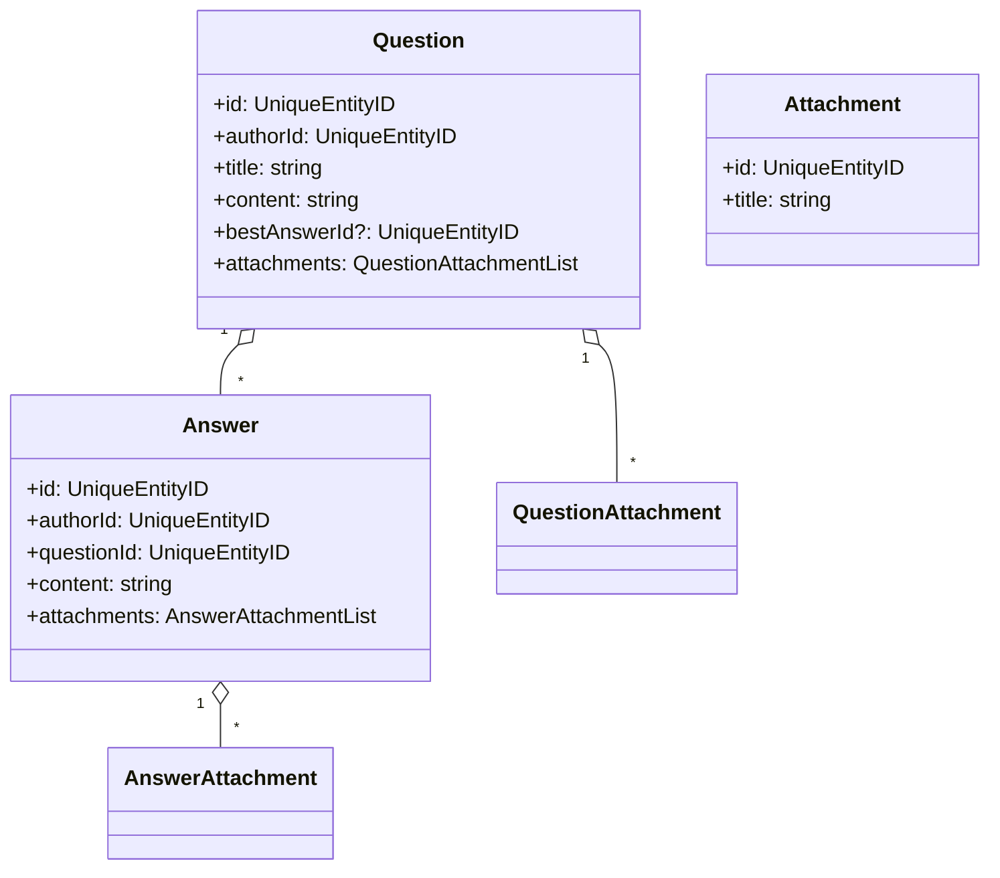

# DDD Forum (Study Project)


A pragmatic, test-driven **DDD / Clean Architecture** implementation of a Q&A forum domain.  
It focuses on **expressive domain models**, **use case orchestration**, **domain events**, and **in-memory adapters** to keep the project simple and highly readable.

> ✔️ Ideal as a portfolio piece to demonstrate architecture, testing discipline, and domain modeling.

---

## ✨ Highlights

- **Clean architecture boundaries**
  - `core/` (primitives: `Entity`, `UniqueEntityID`, `Either`, `WatchedList`)
  - `domain/` (entities, value objects, use cases, repositories)
  - `test/` (in-memory repositories + factories)
- **Rich domain model**: `Question`, `Answer`, `Attachment`, `Comment`, `Student`, `Instructor`
- **Attachment diffing** with `WatchedList`
- **Domain Events** (e.g., choose best answer) with decoupled handlers
- **Use cases orchestrate repositories** (no anemic domain)
- **Type-safe** (strict TypeScript), **linted** (ESLint), **formatted** (Prettier)
- **Test-driven** with Vitest

---

## 🧭 Architecture at a Glance



**Design notes**

- **Use cases** apply business rules and coordinate repositories (including cascading/attachment sync).
- **Repositories** are interfaces; **in-memory implementations** live under `test/repositories` for fast feedback.
- **Domain Events** broadcast changes without coupling aggregates to handlers.

---

## 📂 Folder Structure

```text
src/
  core/
    either.ts
    entities/
      aggregate-root.ts
      entity.ts
      unique-entity-id.ts
      watched-list.ts
    errors/
      use-case-error.ts
    repositories/
      pagination-params.ts
    types/
      optional.ts

  domain/
    forum/
      application/
        repositories/
          answers-repository.ts
          answer-attachments-repository.ts
          answer-comments-repository.ts
          questions-repository.ts
          question-attachments-repository.ts
          question-comments-repository.ts
        use-cases/
          answer-question.ts
          choose-question-best-answer.ts
          comment-on-answer.ts
          comment-on-question.ts
          create-question.ts
          delete-answer.ts
          delete-answer-comment.ts
          delete-question.ts
          delete-question-comment.ts
          edit-answer.ts
          edit-question.ts
          fetch-answer-comments.ts
          fetch-question-answers.ts
          fetch-question-comments.ts
          fetch-recent-questions.ts
          get-question-by-slug.ts
          errors/
            not-allowed-error.ts
            resource-not-found-error.ts
      enterprise/
        entities/
          answer.ts
          answer-attachment.ts
          answer-comment.ts
          attachment.ts
          comment.ts
          instructor.ts
          question.ts
          question-attachment.ts
          question-comment.ts
          student.ts
          value-objects/
            slug.ts
        answer-attachment-list.ts
        question-attachment-list.ts

test/
  factories/
    make-answer.ts
    make-question.ts
    make-answer-attachment.ts
    make-question-attachment.ts
    make-answer-comment.ts
    make-question-comment.ts
  repositories/
    in-memory-answers-repository.ts
    in-memory-answer-attachments-repository.ts
    in-memory-answer-comments-repository.ts
    in-memory-questions-repository.ts
    in-memory-question-attachments-repository.ts
    in-memory-question-comments-repository.ts
```

> Note: there’s a spec file set mirroring most use cases in `src/domain/forum/application/use-cases/*.spec.ts`.

---

## 📦 Tech Stack

- **Language**: TypeScript
- **Test**: Vitest
- **Build**: tsconfig; Vite test config
- **Code quality**: ESLint + Prettier
- **Architecture**: DDD + Clean Architecture

---

## 🚀 Getting Started

### Prerequisites

- Node **18+** (recommended: latest LTS)
- npm or pnpm

### Install & test

```bash
npm ci           # or: npm install
npm test         # run vitest once
npm run test:watch
npm run lint
npm run format
```

> If you’re on Windows and see CRLF/LF warnings, consider adding:
>
> ```
> # .gitattributes
> * text=auto eol=lf
> ```
>
> and running `git add --renormalize .`

---

## 🧪 Testing Strategy

- Unit and application tests target **use cases** and **value objects**.
- **In-memory repositories** make tests fast and deterministic.
- The **happy path + edge cases** are covered (e.g., NotAllowedError, ResourceNotFoundError).

Common scripts (adjust if your `package.json` differs):

```json
{
  "scripts": {
    "test": "vitest run",
    "test:watch": "vitest",
    "lint": "eslint . --ext .ts",
    "format": "prettier --write ."
  }
}
```

---

## 🧱 Domain Modeling Details

### Entities & relationships



### Attachment diffing

- `WatchedList` tracks **current / new / removed** items.
- Use cases compute the desired set of attachment IDs (`["1","3"]`) and update the list.
- Repositories persist the new state; **no duplication** of diff logic.

### Domain Events

- Example: `ChooseQuestionBestAnswer` emits an event that can trigger:
  - Notification to the answer’s author,
  - Updating a projection,
  - Analytics hook, etc.
- Handlers stay decoupled from aggregates.

---

## 🧰 Repositories & Use Cases

- **Repositories** are **interfaces** under `application/repositories`.
- **Use cases** receive repositories via constructor (dependency injection).
- In tests, we pass **in-memory** implementations from `test/repositories`.

**Pattern**

```ts
const useCase = new EditQuestionUseCase(questionsRepo, questionAttachmentsRepo);
const result = await useCase.execute({ ... });
if (result.isLeft()) { /* handle error */ }
```

**Errors** use an `Either`-style API for explicit control flow:

```ts
type Result<T> = Either<NotAllowedError | ResourceNotFoundError, T>;
```

---

## 🧭 How to Extend (Ideas)

- Add a **persistence adapter** (e.g., Prisma, Drizzle) implementing repo interfaces.
- Add an **HTTP interface** (Fastify/NestJS) with DTOs mapping to use case inputs.
- Implement **domain event bus** (simple sync bus or Node’s `EventEmitter`) and dedicated handlers.
- Introduce **auth boundary** and roles (e.g., `Student`, `Instructor`) at the application layer.

---

## 📘 Coding Guidelines

- **Conventional Commits** (`feat:`, `fix:`, `refactor:`, `test:`, `docs:`, `chore:`)
- **One responsibility per commit** when possible.
- **Immutable IDs** (`UniqueEntityID`), avoid leaking primitives in domain APIs.

---

## 🗺️ Roadmap

- [ ] Persistence adapters (SQL / Prisma)
- [ ] HTTP API boundary (Fastify/Nest/Nest CQRS)
- [ ] Event bus + async handlers
- [ ] Read models / projections
- [ ] CI (GitHub Actions) for lint/test

---

## 📄 License

This project is released under the **MIT License**.  
See `LICENSE` (add one if you haven’t yet).

---

## 💬 Why this project matters

- Demonstrates **real-world domain modeling** (non-trivial rules, attachments, best answer).
- Clean separation of **domain**, **application**, and **infrastructure** concerns.
- Testability and maintainability by design — a foundation you can grow into a production-grade system.
